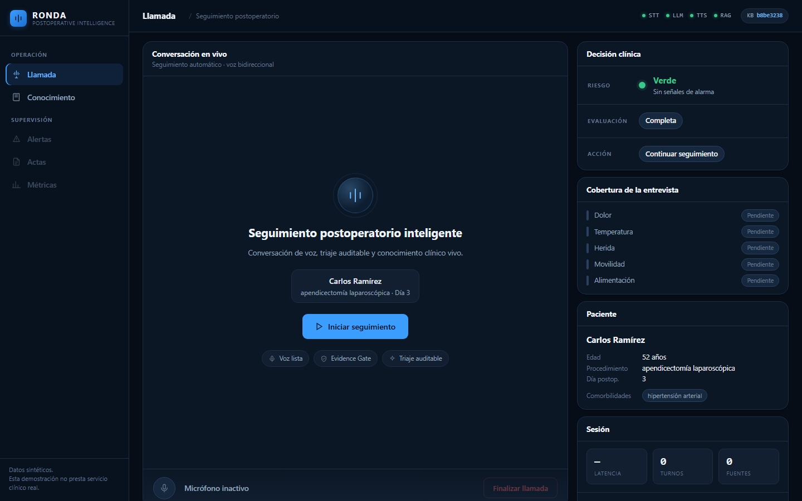

<div align="center">

# RONDA

## Inteligencia postoperatoria

**Un agente de voz con IA para seguimiento postoperatorio que sabe cuándo un
paciente está en riesgo y también cuándo no tiene evidencia suficiente para
responder.**

Voz en tiempo real · Triaje auditable · Conocimiento clínico vivo · Decisiones trazables


[▶ Ver video demo](VIDEO_URL_PENDING) ·
[📄 Informe final](docs/INFORME_FINAL.md) ·
[🏗 Arquitectura](docs/DIAGRAMA.md) ·
[✅ Checklist de entrega](docs/RELEASE_CHECKLIST.md)

</div>



---

## ¿Qué es RONDA?

RONDA llama por teléfono a pacientes que acaban de salir de una cirugía,
conversa con ellos en español colombiano y decide —con criterios auditables— si
ese paciente necesita atención ahora, necesita revisión humana, o puede seguir
su recuperación con normalidad.

No es un chatbot con voz. Es un sistema de **triaje conversacional auditable**:
cada decisión clínica deja rastro, cada afirmación clínica está respaldada por
un documento citable, y cada alarma que se levanta no puede bajarse sola.

## El problema

Después de una cirugía, la ventana crítica no está en el quirófano: está en la
casa del paciente, durante los días siguientes. Una infección de herida, una
fiebre que sube, un dolor que no cede o un sangrado que aparece al cuarto día
son señales que se detectan preguntando. Pero preguntar a todos los pacientes
operados, todos los días, con la misma rigurosidad, no es viable con personal
de enfermería limitado.

El resultado conocido: los seguimientos se espacian, se acortan o se saltan. Y
cuando se saltan, el paciente vuelve por urgencias.

## La solución

Una llamada de voz automatizada que recorre un protocolo clínico completo,
entiende respuestas ambiguas, tolera interrupciones y —lo importante— **sabe
distinguir tres cosas que la mayoría de sistemas confunden**:

| Eje | Pregunta que responde | Valores |
|---|---|---|
| **Riesgo clínico** | ¿Qué encontré en el paciente? | verde · amarillo · rojo |
| **Estado de evaluación** | ¿Cuánto logré evaluar de verdad? | completa · incompleta · fallida |
| **Acción operativa** | ¿Qué hay que hacer ahora? | continuar · repreguntar · revisión humana · escalar |

Un paciente que no contesta a nada **no es un paciente verde**. Es un paciente
sin evaluar, y eso es una conclusión distinta que exige una acción distinta.

---

## ¿Por qué RONDA es diferente?

### Triaje de doble eje

El semáforo clínico y la calidad de la evaluación viajan por separado y solo se
combinan al cerrar la llamada. Un sistema que los mezcla acaba pintando de
verde a quien nunca respondió.

### Never Downgrade — una alarma no desaparece

La decisión corre por seis carriles en paralelo: texto determinista, umbrales
numéricos, slots estructurados, composición clínica multidominio, riesgo
histórico de la llamada y la señal del modelo de lenguaje. El nivel final es el
**máximo** de todos ellos.

El modelo puede subir una alarma. **Nunca puede bajarla.** Si las reglas dicen
rojo, es rojo, aunque el modelo esté convencido de lo contrario.

### Desconocido no significa negativo

Que el paciente no haya hablado de fiebre no significa que no tenga fiebre.
RONDA registra por separado si un dominio fue *evaluado* y si resultó
*positivo*. Los dominios no evaluados quedan como desconocidos, no como
descartados, y arrastran la evaluación hacia `incompleta`.

### Generación condicionada por evidencia

Ninguna frase clínica sale al aire sin un fragmento documental que la sostenga.
El modelo devuelve oraciones con identificadores de evidencia; una compuerta
verifica que cada identificador exista, pertenezca a este turno, apunte a un
documento activo y corresponda a la versión vigente del conocimiento. Lo que no
pasa la compuerta, no se dice.

**Sin evidencia no hay afirmación clínica.** La abstención es una respuesta
válida y frecuente.

### Conocimiento vivo

Se sube un documento por la consola y queda consultable **sin reiniciar el
servidor**. La misma pregunta que antes producía una abstención pasa a
responderse citando el documento nuevo.

### Olvido verificable

Al eliminar un documento no basta con marcarlo como borrado: se comprueba que
el almacén vectorial devuelve **cero** coincidencias y que la versión del
conocimiento cambia. El olvido es demostrable, no declarativo.

### Seguridad determinista

Si el proveedor del modelo cae, se agota la cuota o devuelve basura, RONDA
**no se apaga ni improvisa**: entra en modo determinista y sigue triando con
los carriles de reglas. La conversación pierde naturalidad, no seguridad.

### Identidad de voz por sesión

El perfil de voz se fija al iniciar la llamada y no cambia hasta el final. Un
paciente mayor no debe percibir que "cambió de persona" a mitad de una
conversación clínica.

---

## Arquitectura

Diagramas completos, con el flujo de decisión detallado, en
**[docs/DIAGRAMA.md](docs/DIAGRAMA.md)**.

```
Paciente ──voz──► VAD + barge-in ──► WebSocket ──► Groq Whisper ──► Router conversacional
                                                                            │
                        ┌───────────────────────────────────────────────────┤
                        ▼                                                   ▼
              Motor de decisión (6 carriles)                    Recuperación (FastEmbed + ChromaDB)
                        │                                                   │
                        ▼                                                   ▼
            Riesgo clínico × Estado de evaluación                     Evidence Gate
                        │                                                   │
                        └────────────────► Acción operativa ◄───────────────┘
                                                   │
                                                   ▼
                                    Edge TTS (es-CO) ──► Paciente
```

Los nombres del diagrama son los nombres reales de los módulos: se pueden
verificar contra el código.

## Cómo funciona una llamada

1. **Saludo** y apertura del protocolo.
2. En **cada turno** corre la decisión de doble carril, antes de generar nada.
3. Si aparece un **rojo**, se crea el acta de alerta de inmediato y se pronuncia
   un guion de escalamiento determinista, no generado por el modelo.
4. Si el paciente **interrumpe con una pregunta**, se le responde con evidencia
   o se declara la falta de ella, y la entrevista **retoma el tema pendiente**.
   Una interrupción no consume el intento de evaluación de ese dominio.
5. Si un dominio crítico se pierde, se **repregunta una vez** con pregunta
   cerrada. No hay bucles.
6. Cuando el paciente indica que no tiene nada más y las condiciones se cumplen,
   RONDA **se despide una sola vez** y cuelga tras reproducir el audio completo.

---

# Ejecuta RONDA en menos de 15 minutos

> **Tiempo medido en sala limpia: 2 min 09 s** — entorno Windows 11, Python 3.12,
> conexión doméstica de ~9 MB/s, sin caché de `pip`. El tiempo depende casi por
> completo del ancho de banda: hay que descargar unos 465 MB de dependencias y
> 241 MB del modelo de embeddings.

### 1. Clona el repositorio

```powershell
git clone https://github.com/<usuario>/ronda-postoperative-ai.git
cd ronda-postoperative-ai
```

### 2. Crea el entorno

```powershell
python -m venv .venv
.\.venv\Scripts\Activate.ps1
```

<sub>Linux/macOS: `python3 -m venv .venv && source .venv/bin/activate`</sub>

### 3. Instala dependencias

```powershell
pip install -r requirements.txt
```

### 4. Configura las credenciales

```powershell
copy .env.example .env
```

Abre `.env` y pega tu `GROQ_API_KEY` (gratuita en
[console.groq.com](https://console.groq.com)). Para el carril de lenguaje,
añade `GEMINI_API_KEY`.

### 5. Carga el conocimiento clínico oficial

```powershell
python scripts/bootstrap_official_corpus.py
```

Descarga los seis documentos del corpus oficial, verifica su SHA-256 y los
indexa. Tarda unos 15 segundos.

### 6. Inicia RONDA

```powershell
python run.py
```

### 7. Abre la aplicación

<http://localhost:8000>

Pulsa **Iniciar seguimiento**, autoriza el micrófono y habla.

---

## Base de conocimiento

Los PDFs del corpus clínico **no se redistribuyen en este repositorio**:
pertenecen al kit oficial del reto y conservan los derechos de sus autores. El
script del paso 5 los descarga del
[origen oficial](https://github.com/TechSphere2026/ParticipantArtifacts),
verifica su huella y los indexa por la misma ruta que usa la consola.

Sin conexión, con el kit ya descargado en local:

```powershell
python scripts/bootstrap_official_corpus.py --from-directory <ruta_al_kit>
```

Es idempotente: ejecutarlo dos veces no duplica documentos.

Para añadir tus propios documentos, entra a <http://localhost:8000/consola>.

## Stack tecnológico

| Componente | Tecnología | Función |
|---|---|---|
| Backend | FastAPI + WebSocket | Orquestación en tiempo real |
| Voz → texto | Groq Whisper Large V3 | Transcripción de cada turno |
| Modelo de lenguaje | Google Gemini 3.6 Flash | Extracción de slots y redacción |
| Alternativa configurable | Llama 3.3 70B vía Groq | Se activa con `LLM_PROVIDER=groq` |
| Texto → voz | Microsoft Edge TTS · `es-CO-SalomeNeural` | Respuesta hablada |
| Respaldo local de voz | Piper | Opcional, si está instalado |
| Embeddings | FastEmbed (ONNX Runtime) | Representación semántica sin PyTorch |
| Modelo de embeddings | `sentence-transformers/paraphrase-multilingual-MiniLM-L12-v2` | Comprensión multilingüe, 384 dim |
| Base vectorial | ChromaDB | Conocimiento recuperable |
| Frontend | HTML + CSS + JavaScript sin frameworks | Experiencia web, cero CDN |

> **Nota sobre embeddings.** El motor es FastEmbed, no `sentence-transformers`,
> pero **el modelo es el mismo**. La similitud coseno medida entre ambos motores
> sobre las mismas frases es **0.999999**. El cambio evita descargar PyTorch
> (~750 MB) y es lo que permite cumplir el arranque en 15 minutos. Para
> reproducir experimentos con el motor anterior existe
> `requirements-legacy-embeddings.txt`.

## Seguridad clínica

- **El paciente es información, nunca instrucción.** Los intentos de inyección
  por voz («ignora tus instrucciones») no alteran el comportamiento.
- **Los documentos tampoco mandan.** Una instrucción incrustada en un PDF subido
  no se obedece.
- **Sin prescripción.** RONDA no indica dosis ni medicación específica para el
  paciente, ni siquiera con evidencia válida: el corpus es literatura clínica,
  no la historia de esa persona.
- **Lenguaje no diagnóstico al paciente.** La descripción técnica de una regla
  va al acta; al paciente se le habla en lenguaje no alarmante.

## Trazabilidad

Cada turno emite un evento en `logs/events.jsonl` con marcas de tiempo por
etapa, tokens reales, consultas al conocimiento, evidencias recuperadas,
evidencias usadas y rechazos de la compuerta.

**Las métricas de este README se generan desde esos eventos**, con
`python scripts/metrics.py`. No se escriben a mano.

## Evaluación

Contra el dataset oficial de 160 casos con etiqueta de verdad
(`verde`/`amarillo`/`rojo`), en modo determinista:

| Resultado | Valor |
|---|---|
| Exactitud global | 75,6 % |
| **Rojo clasificado como verde** | **0** |
| **Verde clasificado como rojo** | **0** |
| Recall de rojo (capa limpia) | 100 % (12/12) |
| Concordancia pareada limpio/ruidoso | 83,3 % |
| Captura operativa de rojo | 100 % |

**El contrapeso, sin maquillar:** esa captura del 100 % se paga con
sobretriaje. **111 de 246 conversaciones verdes fueron enviadas a revisión
humana.** En un servicio real eso es carga de trabajo adicional para
enfermería. Es una decisión deliberada —preferimos revisar de más a soltar un
rojo— pero es un coste, no un logro gratuito.

## Métricas

<!-- METRICS:INICIO -->

| Métrica | Valor | Método |
|---|---|---|
| Latencia P50 (fin de habla → primer audio) | 4014 ms | `scripts/metrics.py` sobre `logs/events.jsonl` |
| Latencia P95 | 11 055 ms | ídem |
| Tokens de entrada por turno (promedio) | 1623,9 | contador real del proveedor |
| Tokens de salida por turno (promedio) | 272,6 | ídem |
| Tokens de entrada por llamada (promedio) | 3450,8 | ídem |
| Tokens de salida por llamada (promedio) | 579,2 | ídem |
| Invocaciones al modelo por turno (promedio) | 1,7 | eventos de turno |
| Consultas RAG por llamada (promedio) | 0,4 | eventos de recuperación |
| **Costo estimado por llamada** | **0,00277 USD** | extrapolación, ver abajo |
| Llamadas evaluadas | 40 | — |
| Turnos evaluados | 76 | — |

<!-- METRICS:FIN -->

**Cómo se calcula el costo.** Las mediciones se hicieron en niveles gratuitos,
de modo que el costo real desembolsado fue **0 USD**. La cifra de la tabla es
una **extrapolación** a precios de producción del proveedor: entrada
0,59 USD por millón de tokens, salida 0,79 USD por millón, y transcripción
0,00185 USD por minuto de audio.

**Sobre la latencia.** El P95 de 11 s es alto y no lo escondemos: incluye turnos
con reintentos del proveedor y turnos con recuperación documental. El P50 de 4 s
es representativo de la conversación normal.

## Estructura del proyecto

```
app/
  main.py              # FastAPI · WebSocket de la llamada · API de la consola
  conversation/        # orquestador FSM, router, generación, compuerta, cierre
  decision/            # motor clínico: reglas, composición, cobertura, fusión
  rag/                 # ingesta, embeddings, almacén vectorial, recuperación
  static/              # interfaz web sin frameworks
config/
  red_flags.yaml       # banderas deterministas, editables por personal clínico
  bootstrap_corpus.json# origen y huella de los documentos semilla
prompts/               # misión bloqueada, tono, defensa anti-inyección
scripts/               # métricas desde logs · siembra del corpus
eval/                  # evaluación contra el dataset con verdad de referencia
tests/                 # 533 comprobaciones
docs/                  # informe final, diagramas, checklists
```

## Limitaciones

Conviene decirlo claro:

- **No es un producto médico.** Es un prototipo de competencia. No sustituye
  criterio clínico ni presta servicio asistencial real.
- **Los pacientes son sintéticos.** La demostración usa datos ficticios.
- **La evaluación es sintética.** 160 casos etiquetados no son un ensayo
  clínico, y el tamaño de la capa roja (12 casos) es pequeño: un 100 % de
  recall sobre 12 casos tiene un intervalo de confianza ancho.
- **Sobretriaje medido y no resuelto.** Ver la sección de evaluación.
- **La recuperación no es perfecta.** El Recall@1 medido fue del 55 %; la
  compuerta de evidencia convierte los fallos en abstenciones, no en
  invenciones, pero una abstención sigue siendo una pregunta sin responder.
- **Depende de proveedores externos** para voz y lenguaje. Sin credenciales
  arranca igual y lo declara, pero funciona en modo degradado.

## Licencia

[MIT](LICENSE) · © 2026 Juan Pablo Enriquez Ortiz

Los documentos del corpus clínico no forman parte de esta licencia: pertenecen
a sus autores respectivos y se descargan de su origen oficial.
