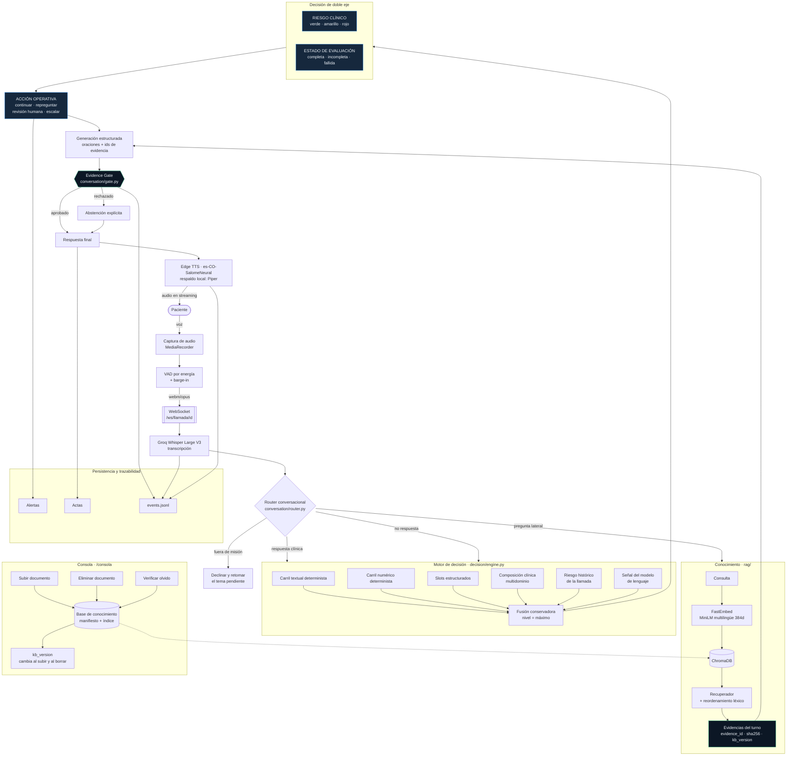
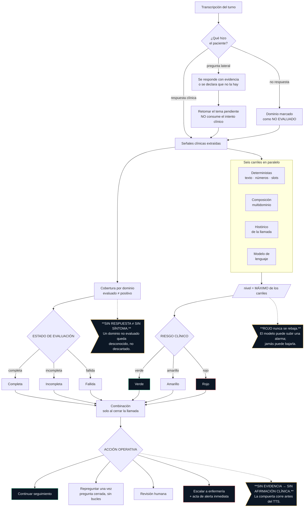

# Arquitectura de RONDA

Los nombres de los nodos corresponden a los módulos reales del código. Se
pueden verificar abriendo los archivos que se citan en cada bloque.

---

## 1. Arquitectura del sistema



**Puntos que conviene mirar dos veces:**

- La **recuperación ocurre siempre**, antes de decidir si la pregunta es de
  misión. Decidirlo antes de mirar el conocimiento activo fue precisamente el
  fallo que dejaba inalcanzable un documento recién subido.
- El **Evidence Gate está antes del TTS**, no después. Lo que no pasa la
  compuerta nunca llega a pronunciarse.
- `kb_version` cambia **tanto al subir como al borrar**. Es lo que hace
  demostrable el olvido.

---

## 2. Flujo de seguridad y decisión



### Las tres reglas que gobiernan el sistema

| Regla | Qué impide | Dónde vive |
|---|---|---|
| **ROJO nunca se rebaja** | Que el modelo tranquilice sobre una alarma detectada por reglas | `decision/engine.py` |
| **Sin respuesta ≠ sin síntoma** | Que un paciente no evaluado se pinte de verde | `decision/cobertura.py` |
| **Sin evidencia → sin afirmación** | Que se pronuncie contenido clínico inventado | `conversation/gate.py` |

---

## 3. Ciclo de conocimiento vivo

```mermaid
sequenceDiagram
    autonumber
    actor U as Personal clínico
    participant C as Consola
    participant I as Ingesta
    participant V as ChromaDB
    actor P as Paciente

    P->>+V: ¿Qué dice el protocolo sobre X?
    V-->>-P: sin evidencia suficiente → ABSTENCIÓN

    U->>+C: Subir documento
    C->>I: extraer, trocear, vectorizar
    I->>V: indexar fragmentos
    V-->>-C: kb_version cambia

    P->>+V: la MISMA pregunta
    V-->>-P: responde CITANDO documento y fragmento

    U->>+C: Eliminar documento
    C->>V: borrar vectores + lápida en el manifiesto
    V-->>-C: kb_version vuelve a cambiar

    U->>+C: Verificar olvido
    C->>V: sondear el almacén
    V-->>-C: 0 vectores restantes

    P->>+V: la MISMA pregunta otra vez
    V-->>-P: vuelve a ABSTENERSE
```

Este ciclo es reproducible de extremo a extremo con las pruebas de
`tests/test_g5_end_to_end.py`, que recorren la ruta humana completa desde
`POST /api/llamada/iniciar`.
